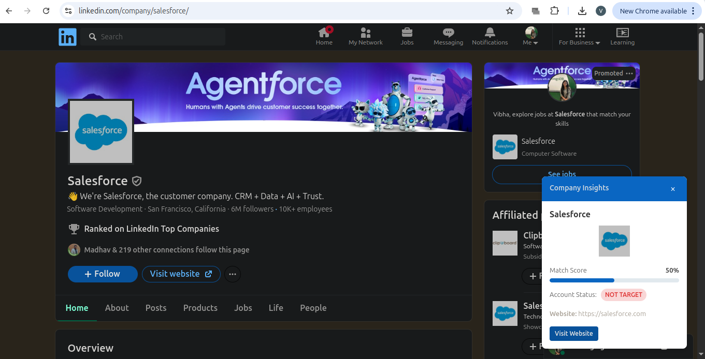

# LinkedIn Company Insights Chrome Extension

A Chrome extension that enhances LinkedIn profile pages by displaying rich company insights in a clean, responsive floating widget.

## 🔍 Features

- Extracts company information from LinkedIn pages
- Determines company domain intelligently (now handles spaces with dashes)
- Uses Clearbit public API to fetch:
  - Company logo
  - Website URL
  - Industry and size data
- Calculates a **match score** using advanced factors like industry relevance and company size
- Determines if the company is a **Target** or **Not Target**
- Displays:
  - Company name
  - Match score with visual progress bar
  - Account status with color-coded tags
  - Company logo
  - "Visit Website" button
- Toggle widget visibility (with persistent state across sessions)
- Graceful error handling and fallbacks for missing data
- Small delay on page load to ensure LinkedIn content is present

## 🚀 Installation

1. Clone or download this repository.
2. Open Chrome and navigate to `chrome://extensions/`
3. Enable **Developer mode** (top right corner)
4. Click **Load unpacked** and select the extension's root folder
5. The extension will now be active on LinkedIn profile pages

## 💡 Usage

1. Navigate to any LinkedIn profile or company page
2. The widget will appear at the bottom right
3. Use the **"X"** to hide the widget, and the **info icon** to bring it back
4. Preferences are saved using `chrome.storage` (so widget state is remembered)

## 🛠 Technical Details

- **Built With:**  
  - JavaScript (ES6+)  
  - HTML (via DOM API)  
  - CSS  
  - Chrome Extension APIs

- **No external libraries or frameworks used**

## 📁 Files

| File           | Description                                 |
|----------------|---------------------------------------------|
| `manifest.json`| Chrome Extension configuration              |
| `content.js`   | Main logic injected into LinkedIn pages     |
| `styles.css`   | Styling for the widget                      |
| `icons/`       | Folder for extension icons                  |

---

## ⚠️ Notes

- This extension uses Clearbit's public API for fetching company data.
- You may need a Clearbit API key — insert it in the appropriate section of `content.js`.

---

## ✨ Improvements Over Base Version

- ✅ Improved domain extraction using dashes instead of removing spaces
- ✅ Company logo and website displayed
- ✅ Better match score logic (includes industry + size)
- ✅ Robust error handling for smoother experience
- ✅ Minor delay ensures content injection happens after LinkedIn load

---

## 🧪 Example Screenshot

## 📬 Feedback

Open an issue or submit a pull request if you'd like to contribute or request features.

